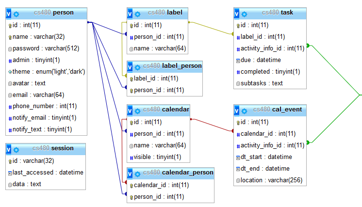
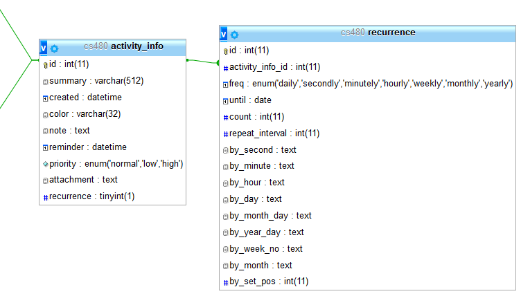

# Senior Project
## Introduction
The reasons behind choosing my senior project are both practical and a bit sentimental. One of the biggest incentives being to learn about databases, which I had only barely touched on in the past, and sessions, which I had never touched before. I also wanted to return to my origins and end my college experience with web programming. While not programming languages, HTML and CSS started me on to this path so it seemed fitting. I ultimately chose PHP because of its strong integration with MySQL and sessions; and the AngularJS framework as a guide to help me code using the MVC architecture. Since I had used neither before (and had only begun learning Javascript earlier this semester), I had to learn them from scratch. Essentially, this project was almost completely foreign territory for me.

## Overview
The project itself is a task/calendar web app built on AngularJS and PHP. Moment JS and Twitter Bootstrap are also used, mostly to save time when it became clear how close the deadline was approaching. Moment JS can easily manipulate datetimes, which saved a ton of time when creating the calendar views, and Bootstrap was used mostly for the built-in modal and quick styling of inputs and buttons. Given more time, Bootstrap would likely be removed and replaced with my own code. 

The key feature is that users can create tasks and events. They can further organize these using labels and calendars respectively. Tasks can also include a set of subtasks. A full feature set would include sharing labels and calendars with other users, different views for tasks and events, reoccurring tasks and events, and reminders, but not all of these were included for reasons addressed in the “Struggles and Changes” section. Of note, throughout the app, the use of the word “activities” is used to reference an item that can be either an event or task, since these two overlap in a lot of their functionality and share a very similar backend.

## Database
Almost everything in the app is stored in a MySQL database. The design of the tables themselves can be seen below. With the exception of the session table, all tables are inter-connected in some form. Label_person and calendar_person would have been used for sharing labels and calendars with other users in an item-to-person, one-to-many relationship if the feature had been finished.


 
Task and events both share a lot of fields. To reduce redundancy and normalize the database more, their like-fields are stored in a separate table called activity_info, which in turn points to the recurrence table. 
 


Recurrence in the app is designed around the RRule standard, which allows for easy importing and exporting of other calendars, as many calendar apps such as iCalendar and Google Calender use it. It’s also allows for very versatile reoccurring events or tasks, such as the second to last day of the second week of every third month. Unfortunately, my app doesn’t allow for quite so much detail, but the structure is there should I ever wish to implement it in the future.

## CRUD
On the app’s initial load, it queries to get all tasks, labels, events, and calendars for the logged in user then stores them in a cache service, which is shared between the various pages of the app such that each page load doesn’t need to re-query the server for the same information unless an actual change is made to one of the entries. Each query is setup to auto-retrieve the user id from the session to find the corresponding entries.

The database itself is accessed via a CRUD service on the frontend, which in turn talks to the appropriate CRUD Manager, a wrapper for all CRUD classes that routes requests based on the request method and information provided. The CRUD class (or ActivityCRUD, depending on item) then sends queries to a database wrapper, which will automatically bind parameters and return a promise, which is sent back through the chain to the CRUD service. Below is an overview of the aforementioned process of getting a task by id, with some code removed for brevity’s sake. Note that $joinedActivity is the joined tables of the activity, activity_info, and recurrence. 
###### crud.service.js
```
function get(id) {
  return $http.get(this.base + '?id=' + id)
    .then(promiseComplete)
    .catch(promiseFailed);
}
```

###### ActivityCRUD.php
```
public function get($id)
{
  return $this->db->query(
    "SELECT *, {$this->selectID}
    FROM {$this->joinedActivity}
    WHERE {$this->table}.id = :id",
    array(':id'=>$id)
  );
}
```

###### taskManager.php
```
$manager = new CrudManager(
  $_SERVER['REQUEST_METHOD'],
  new Task(),
  $request,
  isset($_GET['id']) ? $_GET['id'] : null,
  isset($_GET['usewhere']) ? $_GET['usewhere'] : null,
  isset($_GET['where']) ? $_GET['where'] : null
);
```

###### Database.php
```
public function query(
  $query,
  $bindings = array(),
  $fetchStyle = PDO::FETCH_ASSOC,
  $fetchArgs = null
) {
  try {
    $this->statement = $this->conn->prepare($query);

    if (!empty($bindings)) {
      $this->bindValues($bindings);
    }

    $this->statement->execute();
    $result = $this->getResult($query, $fetchStyle, $fetchArgs);
    // Return promise with results or error message 
  } catch (\PDOException $e) {
    // Return promise with error message
  }
}
```

###### CrudManager.php
```
public function getResponse() {
  switch ($this->reqMethod) {
    case 'GET':
      return $this->getGetResponse();
    case 'POST':
      return $this->itemType->create($this->data);
    case 'PUT':
      return $this->itemType->update($this->id, $this->data);
    case 'DELETE':
      return $this->getDeleteResponse();
  }
}
```

## Security
It goes without saying that user input should never be trusted. As such, it’s important to sanitize input in cases where user input is accepted. All input and information from promises on the frontend is escaped automatically through AngularJS to prevent XSS so there was little I had to do there. Database queries did not have that same luxury. As seen in the example above, values passed into Database ask for an associative array of bindings, which is used in bindValues() to, as the name suggests, bind each value in the array, and prevent SQL injection.

User files are also checked. Due to time constraints, the file upload service only supports PNG and JPG files as they were the easiest to validate. A file uploaded to the server is checked to be under the file limit, whether or not it’s a valid image (using PHP’s getimagesize()), and whether or not it’s a PNG or JPG. If these credentials aren’t met, the file is discarded.

## Sessions
Likewise, sessions are stored in a database for added security. Since a session is stored on the server instead of in a cookie on the client side, the client doesn’t have access to any variables and thus cannot change any. The caveat to this is that sessions only last until the user closes their browser. Though there are ways around that, time did not permit me to implement them. In order to save sessions to the database, I had to create my own session handler using the SessionHandlerInterface provided by PHP. Every time a session is to be started, the handler must be set first.

###### Session.php
```
public function start($username)
{
  $this->sessionStart();
  $this->setSessionVariables($username);
}

public function sessionStart()
{
  $handler = new SessionHandler($this);
  session_set_save_handler($handler, true);
  session_start();
}
```

###### SessionHandler.php
```
public function write($id, $data)
{
  $result = $this->session->get($id);

  if ($result['success'] && !empty($result['data'])) {
    $result = $this->session->update($id, array('data'=>$data, 'last_accessed'=>date('Y-m-d H:i:s')));
  } else {
    $result = $this->session->create(array(
      'id'=>$id,
      'data'=>$data,
      'last_accessed'=>date('Y-m-d H:i:s')
    ));
  }
  return $result['success'];
}
```

For example, when a user logs in, Session->start() is called with their username and a new session is created and the user variables are set based on the user’s database fields, both actions utilizing SessionHandler->write().

## Directives and Filters
On the front end, we have the actual displaying and editing of the activities. Activities were created using directives, which allows them to be re-used throughout the app with very little HTML. Take the due today and due in the next seven days task pages:

###### today.html
```
<h1>Today</h1>
<sp-tasks order="['!!due', 'due']" within-days="1"></sp-tasks>
```

###### week.html
```
<h1>Next 7 Days</h1>
<sp-tasks order="['!!due', 'due']" within-days="7"></sp-tasks>
```

This is all that’s on either page. The power with these particular directives lies with the filter “within-days”, which will choose only tasks without due dates and tasks that’re due within the given amount of days. Similarly, there’s also the “in-groups” filter, which is used in conjunction with the task or event directive to filter them based on the label or calendar(s) described.

The templates themselves are fairly simple, utilizing ng-repeat to display every activity within them. It’s also of note that this is where the filters are actually supplied as the values must pass through the directive first, as seen below.
	
###### tasks.html
```
<ul class="task-list">
  <li class="add-task" ng-click="vm.showTaskModal({})">
    <i class="fa fa-plus"></i>
    <span class="task-summary">Add a task</span>
  </li>
  <li ng-repeat="task in vm.tasks | orderBy:vm.order | withinDays:vm.days | inGroups:vm.inLabels" ng-class="{completed: task.completed == true}">
    <i class="fa fa-check check-icon" ng-click="vm.toggleCompleted(task)"></i>
    <span class="task-summary" ng-click="vm.showTaskModal(task)">{{ task.summary }}</span>
  </li>
</ul>
```

###### tasks.directive.js
```
function tasksDirective() {
  return {
    templateUrl: 'modules/tasks/tasks.html',
    controller: 'TasksController',
    controllerAs: 'vm',
    bindToController: true,
    scope: {
      order: '=',
      days: '=withinDays',
      inLabels: '=inGroups'
    }
  };
}
```
	
Also of note, directive controllers will automatically grab the appropriate items to display from the cacheService for its template to use.

## Modals
Modals are used by the directives for all frontend CRUDing. Tasks and events each have their separate modal template which will display the activity’s corresponding information in a form based on the activity (or empty object) passed in. Since modals in Bootstrap act as promises, the corresponding modal service can then act based on the button pressed: delete, cancel, or submit. Delete and cancel are self-explanatory, but submit will result in the activity being either updated or created based on whether or not it has a corresponding id, which an empty object would not have.

## Struggles and Changes
As mentioned in the introduction, this project was mostly foreign territory. As such, I didn’t really know what to expect from it or how much work it would be. Thus, the source of main struggle: getting everything done when I knew next to nothing about a good portion of it. I greatly overestimated how hard the project would be and what I could get done in one semester with three other classes, especially since I planned under the assumption that nothing major would happen in my personal life—which, naturally, something did and lasted the majority of the semester. Knowing what I know now at the beginning, the project would have taken significantly less time and I could have definitely gotten it all done on time.

Additionally, I learned the importance of the agile methodology and that I have a tendency with my perfectionism to use the waterfall methodology. I spent too much time reading up on the topics I needed and not enough coding and not nearly enough on design.  I also spent too much time trying to optimize code rather than getting things working first.

Sessions were also a struggle for me as I couldn’t quite get my head around them at first, though it all seems hilariously easy now. The session handler gave me an especially hard time as I had not come across it immediately and couldn’t figure out how to store the sessions in a database, which was also an afterthought to my design process. Database redesign was a somewhat common occurrence in the beginning of my project as well, as I hadn’t even known what normalizing a database was originally.

Looking back on my code, it could be much more streamlined if I had just spent more time on the design phase. This is especially evident in my CRUD classes, which I originally made as a general-purpose CRUD for reusability, but ultimately had to be changed because they didn’t quite fit my needs. The ActivityCRUD class was also hastily thrown together because I didn’t pick up on my need for it in the design phase, which was a major oversight.  I would have also picked up on a need for an “all” query (tasks, events, labels, and calendars) for a user to reduce the number of API calls made when the web app itself is loaded from its original eight to only one. The code for the backend in general feels cluttered and disorganized compared to the frontend, causing the code to be harder to read and stray from the SOLID principles.

I’d also make time to write more unit tests, as I had no idea—outside of my CRUD classes—when I would break other functions until it happened. In the few I did make time to write, it helped immensely in debugging and writing the actual methods. Not to mention the security that came with knowing my code worked. I’m also aware that test-driven design can make the codebase more precise and cleaner so it’s rather disappointing I did not go that route.

## Conclusion
Despite the struggles I faced, I learned an incredible amount not only about what I set out to learn to begin with, but also the design process and my own practices. I only completed about 50% of what I set out to do in my proposal at the time of writing this paper, but yet I’m sitting at over 2,500 lines of code on a project whose concepts and languages I was learning as I went. In the end, I learned incredibly valuable information that will undoubtedly help me as I start my career.
